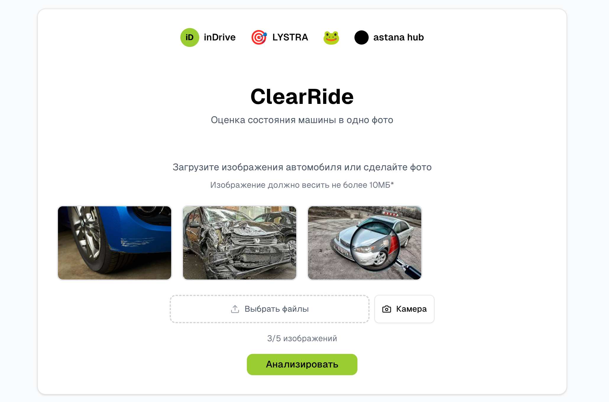

# ClearRide

ВСЕ ФАЙЛЫ ПО ССЫЛКЕ https://drive.google.com/drive/folders/17n1PLjz15XUsyGPUO_cMVeCjT4MKSVl0?usp=sharing

Проект представляет собой прототип системы компьютерного зрения для автоматической оценки состояния автомобилей по фотографиям.  
Модель классифицирует авто по двум основным параметрам:  
- Чистота: чистый / грязный  
- Целостность: битый / не битый
- Дополнительные классификации: разбито стекло / фара, спущено колесо

  
  

Как запускать
Запустите файлы скриптов и закиньте в папку с скриптами и моделями ваше изображение. При запуске введите название изображения.

Разработано с любовью, цель — показать ценность для сервиса inDrive: автоматическая проверка состояния авто для повышения доверия пассажиров, улучшения качества сервиса и снижения нагрузки на сотрудников.

Возможности
- Классификация состояния автомобиля по загруженной фотографии
- Веб-интерфейс на React для тестирования
- API на FastAPI для инференса
- Контейнеризация через Docker для удобного запуска
- Дообученная модель ResNet50 на качественных датасетах

Технологии
- Backend: Python 3.10, FastAPI, PyTorch
- Frontend: React
- ML-модель: ResNet50 (pretrained, fine-tuned)
- Контейнеризация: Docker, Docker Compose

Требования к железу
Рекомендуемые:
- CPU: 4+ ядра
- RAM: 8–16 GB
- GPU: NVIDIA с 6+ GB VRAM
- Диск: SSD, 20+ GB свободного места
